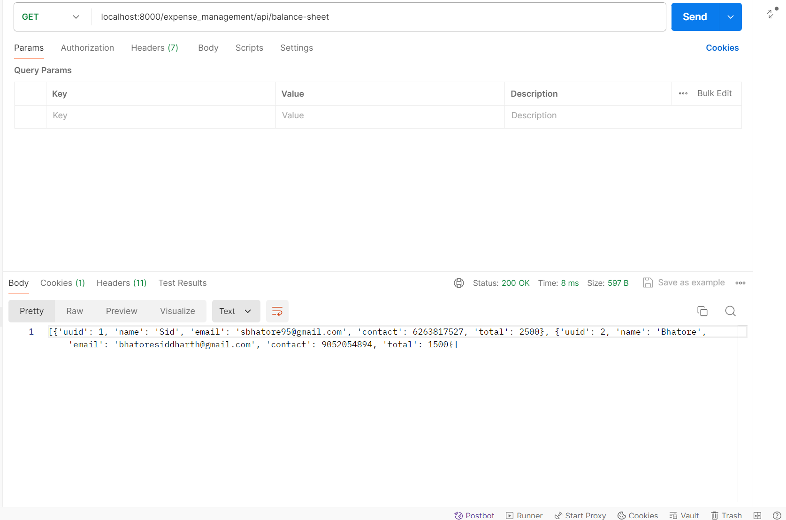

# sharing-expenses
# Sharing Expenses Application

Assumptions:
1. The project can be coded using Django framework,

2. Phone number of every user is distinct,

3. Django's inbuilt database SQLite3 can be used
to store required data,

4. "Retreiving overall expenses" is related to
specifying ```total``` expense values of all the users. Therefore, 
the method used is to display the data of all the users. Hence,
below is the image as an example of the response when
using expense_management/api/get-overall-expenses API.


5. Balance sheet can be returned as an HttpResponse,

6. "Retreiving individual user expenses" is related to
specifying ```total``` expense of the specified user. So, 
all the details (including total which specifies total expense
of the user) is shown. For example, see the details below
for the API endpoint expense_management/api/get-details:


7. Balance sheet is just the expense details of all the 
individuals.

Checkout documentation/commands.md for the step-by-step guide
on what commands were required to finish the application.

Here are what API endpoints look when viewed on POSTMAN:

get user details:

create user:

split equal 1:

split equal 2:

split exact:

split by  percentage:

get overall expenses:

get individual details:

balance-sheet:


**Alert**: In the later version, specifying ```uuid``` for any POST request is not required. The images displayed is taken from a previous iteration of the application.

Setup:
1. cd sharing-expenses/app
2. Run
 ``` bash 
 python3 manage.py runserver 
 ```
 Now the server is being run at localhost:8000

3. The API endpoints are:

    - User Management:

        1. POST: localhost:8000/user-management/api/create-user
            - form-data has to be sent along with the body
                1. ```name```
                2. ```email```
                3. ```contact```

        2. GET: localhost:8000/user-management/api/get-details
            - A query param ```contact``` needs to be sent along
            with it.

    - Expense Management:

        1. POST: localhost:8000/expense_management/api/add-expense
            - ```amount```
            - ```type```: 'equal', 'exact' or 'percentage'
            - ```contacts```
            - if ```type``` is exact:
                - specify ```expenses``` in a comma separated way
            - if ```type``` is percentage:
                - specify ```percentages``` in a comma separated way

        2. GET: localhost:8000/expense_management/api/get-details
            - A query param ```contact``` needs to be sent along 
            with it.

        3. GET: localhost:8000/expense_management/api/get-overall-expenses

        4. GET: localhost:8000/expense_management/api/balance-sheet

#### In case of any queries with the setup, send an email to *sbhatore95@gmail.com*
